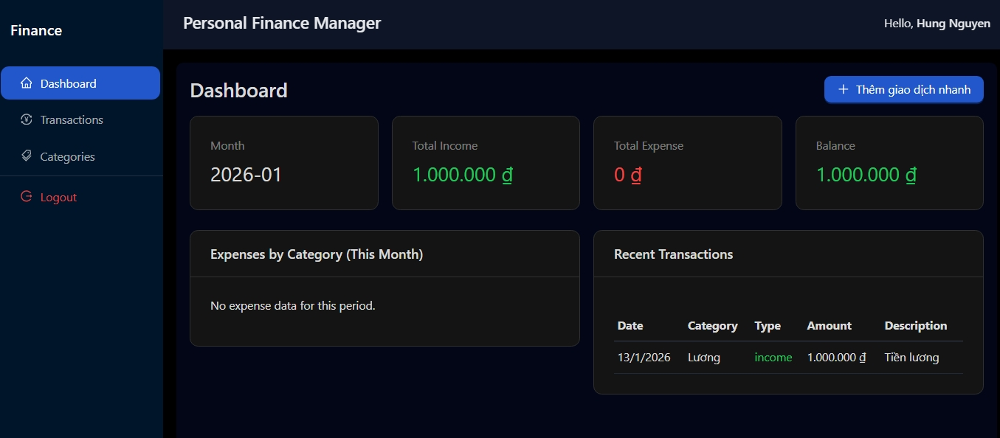
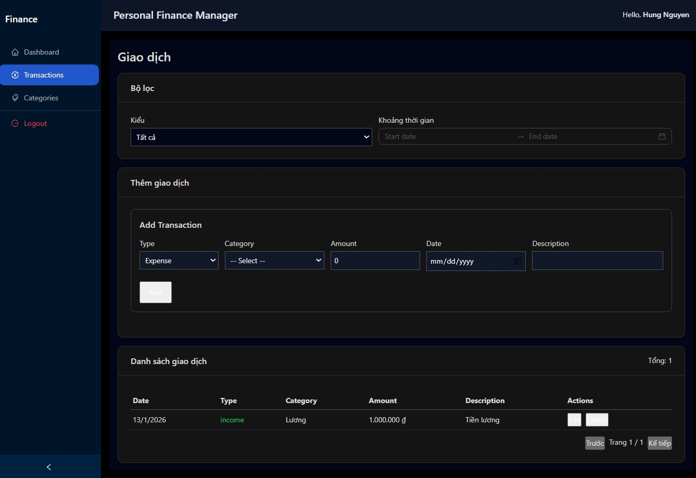
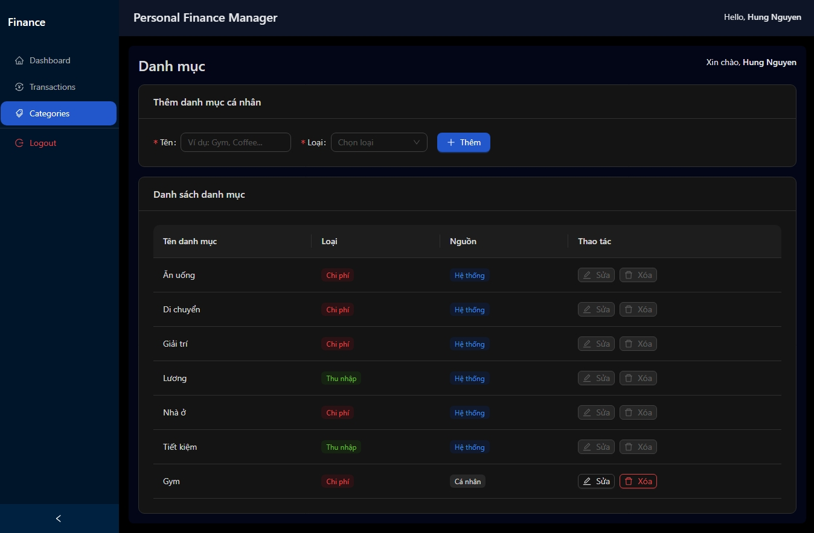

# Personal Finance Manager

A full-stack personal finance management web application built with **React + Ant Design** and **Node.js/Express + SQL Server**.

Users can register, log in, manage income/expense transactions, create custom categories, and view monthly financial summaries via interactive dashboards and charts.

## Tech Stack

- **Frontend**: React (Vite), Ant Design, Axios, React Router, Recharts, Framer Motion, Day.js  
- **Backend**: Node.js, Express.js, mssql, JWT, bcryptjs, express-validator, helmet, cors, morgan  
- **Database**: SQL Server (Users, Categories, Transactions with PK/FK, constraints, indexes)

## Features

- JWT-based authentication (login/register) with hashed passwords (bcrypt).
- User-scoped data: each user only sees their own transactions and categories.
- Transactions:
  - CRUD for income/expense transactions.
  - Filter by type and date range (AntD `RangePicker`).
  - Pagination for transaction list.
- Categories:
  - System categories (Food, Transport, Salary, etc.).
  - Personal categories (user-defined), with CRUD.
- Dashboard:
  - Monthly total income, total expense, and balance.
  - Expense-by-category chart (Recharts pie chart).
  - Recent transactions panel.
  - Clickable summary cards (navigate to Transactions with filters).
  - Quick-add transaction modal (AntD Modal + Form).

## Screenshots

### Dashboard



### Transactions



### Categories



## Getting Started

### Backend

```bash
cd backend
npm install